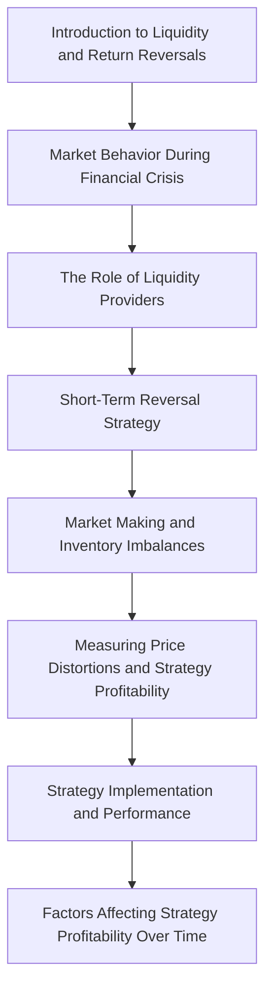

A short-term reversal strategy, where you buy past losers and sell past winners, can be ==highly profitable== (Sharpe ratio up to 5-6) by exploiting market makers' inventory imbalances.

This presentation by Kent Daniel explores **liquidity and return reversals**, revealing how market makers' inventory imbalances create predictable price distortions. You'll learn about a **short-term reversal strategy** that historically generated extraordinary returns, offering practical insights into market inefficiencies. Discover how technological innovations and increased competition have impacted this strategy's profitability, making markets more efficient.

---

## 🔗 Related
- [[How Market-Making Works (Poorly Illustrated)]]
- [[Why "Good News" Can Crudely Crash Your Portfolio]]
- [[How Warren Buffett Did It]]

## Kent Daniel: Liquidity and Return Reversals

  

## 1. Introduction to Liquidity and Return Reversals

  

## 1.1. Market Behavior During the Financial Crisis

==During the 2008 financial crisis, stocks that were already losing money fell much more sharply than winning stocks, but then rebounded significantly once the crisis ended.==

  

1. **Motivation from Momentum Crashes**   
    
    1. The speaker previously discussed **momentum crashes**, which is a topic related to how stock prices behave .
        
    2. This presentation will build on that concept to explain **liquidity and return reversals** .
        
    

  

2. **Performance of Loser vs. Winner Portfolios (Feb 2008 - Mar 2009)**   
    
    1. ==A plot showed the cumulative performance of two types of stock portfolios: "losers" (red line) and "winners" (green line) during the financial crisis== .
        
    2. **Loser stocks** were identified by sorting all NYSE, AMEX, and Nasdaq stocks by their past one-year return and selecting the worst 10% .
        
        1. These are the stocks typically **shorted** in a momentum trade .
            
        2. Examples included financial companies, motor firms like Ford, and International Paper, which suffered due to high **leverage** .
            
        3. Investors "hated" these stocks, with some, like Citibank, falling below a dollar .
            
        
    3. **Winner stocks** were those with the best past performance, typically **bought** in a momentum trade .
        
    4. During the crisis (February 2008 to March 2009), the overall stock market fell significantly, with March 8, 2009, being a low point .
        
    5. The **loser stocks** fell much more dramatically than the **winner stocks** .
        
    

  

3. **Post-Crisis Rebound and Extraordinary Returns**   
    
    1. ==After the crisis eased, the loser stocks bounced back much more than the winners, with past losers recovering all their losses from that period== .
        
    2. Investing in these loser stocks on March 9, 2009, and selling by October 2009 could have yielded a **460% return** .
        
    3. In contrast, investing in "safe" stocks during the same period would have yielded about **26%** .
        
    4. The difference in returns was "extraordinary" .
        
    

  

## 1.2. The Role of Liquidity Providers

==Liquidity providers are crucial in financial markets, stepping in to buy assets when others panic, but their ability to do so can be limited during severe crises, leading to price distortions.==

  

1. **Panic and Liquidity Provision**   
    
    1. One explanation for the extreme market behavior is that people were **panicked** about the loser stocks .
        
    2. Normally, **liquidity providers** would step in to buy these stocks when others are unwilling, preventing extreme price drops .
        
    3. However, in severe, prolonged downturns, **liquidity can dry up** .
        
    4. Warren Buffett's concept of "dry powder" (cash reserves) highlights the importance of having capital available for truly good opportunities, which might be used up if invested too early .
        
    5. Therefore, it's critical for someone to provide liquidity during such times, and these **liquidity provision trades** should be profitable .
        
    

  

2. **Federal Reserve's Role as a Liquidity Provider**   
    
    1. The Federal Reserve, under Bernanke in 2008, acted as a liquidity provider, buying securities in asset-backed fixed-income markets .
        
    2. The Fed's view was that ordinary liquidity providers had run out of money, necessitating their intervention .
        
    

  

3. **Research Focus: The Business of Liquidity Provision**   
    
    1. The research aims to understand how well the **liquidity provision business** works .
        
    2. Many financial firms and individuals act as liquidity providers, buying assets when the market is "making a mistake" (prices are too low or no one else is buying) and selling later for a profit .
        
    3. This business involves considerations like **risk, technology, access to capital, and competition** .
        
    4. The research specifically investigates which economic factors cause liquidity providers to **withdraw capital** when it's most needed .
        
    

  

## 2. Short-Term Reversal Strategy

  

## 2.1. Strategy Overview and Market Making Basics

==The short-term reversal strategy aims to profit from temporary price distortions caused by market makers' inventory imbalances, which are visible in bid-ask spreads.==

  

1. **Narrowing the Research Focus: Short-Term Reversal Strategy**   
    
    1. The study will focus on **equities**, specifically the **100 biggest stocks** traded on US exchanges, which are very liquid .
        
    2. The strategy examined is a **short-term reversal strategy**, a simplified version of **statistical arbitrage (stat arb)** .
        
    3. This strategy involves stepping in when normal liquidity providers are not active .
        
    4. The research will analyze historical performance and how profitability changes over time .
        
    

  

2. **Understanding Market Making and Bid-Ask Spreads**   
    
    1. ==Market making involves setting bid (buy) and ask (sell) prices for a stock, with the difference being the spread, which is how market makers profit== .
        
    2. An example using Apple stock showed a **bid price** (what a market maker will buy at) of \$518.30 and an **ask price** (what a market maker will sell at) of \$518.55 .
        
    3. This means an individual can buy Apple at \$518.55 or sell at \$518.30 .
        
    4. A market maker buys at \$518.30 and sells at \$518.55, making a **25-cent spread** per share .
        
    5. This seems like a good business, as long as the stock price stays near the midpoint (\$518.425) .
        
    

  

3. **Market Maker Risks: Price Movements and Inventory Imbalances**   
    
    1. ==The main risk for market makers is when the stock price moves unexpectedly, leading to losses on their inventory== .
        
    2. If other traders discover Apple's true value is lower (e.g., \$508.517), they will **sell to the market maker** at \$518.30 .
        
    3. This causes the market maker to accumulate a **large inventory of Apple shares** .
        
    4. Simultaneously, fewer people will buy from the market maker at \$518.55 .
        
    5. As the price falls, the market maker loses money on their accumulated inventory .
        
    6. The trade-off for a market maker is making money on the spread when prices are stable versus losing money when prices move unexpectedly and they are caught with the wrong inventory .
        
    7. This accumulation of shares when prices fall is called **building up inventory**, leading to losses .
        
    

  

## 2.2. Measuring Price Distortions and Strategy Profitability

==Market makers' inventory imbalances can cause temporary price distortions, which can be measured by looking at past returns and exploited by a short-term reversal strategy, with profitability assessed using the Sharpe ratio.==

  

1. **Price Distortions Due to Inventory Imbalances**   
    
    1. The core question is whether market makers sometimes set prices that **don't reflect the true value** of a stock .
        
    2. This idea is not new and has been studied by others .
        
    3. ==When a market maker's inventory of a stock becomes very large (e.g., too many Apple shares), they will lower the price to encourage others to buy and reduce their inventory== .
        
    4. Conversely, if a market maker has a **short position** (meaning they've sold shares they don't own, expecting the price to fall) and the price suddenly jumps up, they will need to buy shares to cover their position .
        
    5. To cover a short position when the price is too high, they will offer to buy at a higher price, effectively **raising the stock's price above its true value** .
        
    6. These actions create **price distortions** that the strategy aims to measure and exploit by analyzing past returns .
        
    

  

2. **Measuring Profitability: The Sharpe Ratio**   
    
    1. The profitability of this strategy will be measured using **annualized Sharpe ratios** .
        
    2. The **Sharpe ratio** is the average return earned over a year divided by the volatility (risk) of that return .
        
    3. For example, the market historically has a Sharpe ratio of about **0.4** (8% average return above T-bill rate, 20% volatility) . This serves as a benchmark.
        
    

  

## 3. Strategy Implementation and Performance

  

## 3.1. Forecasting Returns and Regression Analysis

==The short-term reversal strategy forecasts future stock returns by analyzing past residual returns over 29 days, expecting negative coefficients, and uses a GARCH model to manage risk.==

  

1. **Forecasting Returns Using Past Data**   
    
    1. The strategy involves forecasting the returns of individual firms .
        
    2. This is done by **regressing today's return** on the stock's returns from the previous 29 trading days .
        
    3. The regression equation looks at today's return (Day T) based on returns from one day ago, two days ago, up to 29 days ago .
        
    4. ==If the market maker's inventory logic holds, a negative past return (price fell, market maker bought) should lead to a positive future return (market maker lowers price to sell inventory), meaning the regression coefficients (gammas) should be negative== .
        
    5. The study focuses on the **100 biggest firms** on US exchanges, re-forming the sample annually in January .
        
    6. This focus on large firms ensures they **always trade**, avoiding issues with non-trading stocks .
        
    7. The strategy will also be tested on data going back to the 1920s, though that data is more problematic .
        
    

  

2. **Calibration and Refinements to the Regression Model**   
    
    1. The strategy is calibrated by running the regression for all 10,000 trading days in the sample (40 years from 1972, 250 trading days/year) .
        
    2. **Key refinements** to the regression:
        
        1. Instead of past returns, **past residual returns** are used . This is because market makers lose money when a stock moves unexpectedly, not just with the overall market .
            
        2. The coefficient is **zeroed out around earnings announcement dates** . Market makers are aware of these dates and are less likely to be hurt by expected price movements .
            
        3. No reversal is observed around market moves or earnings announcements, supporting these adjustments .
            
        
    3. **Regression Results Summary**   
        
        1. A graph summarizes the coefficients and t-statistics from these regressions .
            
        2. The effect is "huge," with t-statistics up to 25, remaining statistically significant even three weeks later .
            
        3. The magnitude indicates that a 1% jump in Apple's price would lead to a 5 basis point (0.05%) drop the next day, and another 3 basis points on average after that .
            
        4. The **overall reversal is about 12%** over this period, which is "really, really big" economically .
            
        5. This suggests market makers are willing to pay a lot to rebalance their inventory, whether it's too large (selling) or too short (buying to cover) .
            
        
    

  

## 3.2. Risk Management and Strategy Performance

==The short-term reversal strategy uses a GARCH model for risk management and historically achieved extraordinary Sharpe ratios, significantly outperforming the market, especially in the late 1980s and early 1990s.==

  

1. **Managing Risk with GARCH Procedure**   
    
    1. Implementing any investment strategy requires considering both **return and risk** .
        
    2. To manage risk, the strategy uses a **Glosten Jagannathan Runkle GARCH procedure** .
        
    3. This is a sophisticated method for calculating and tracking **volatility (market variance)** over time .
        
    4. The model effectively captures market variance, even during periods of high volatility like the financial crisis .
        
    

  

2. **Implementing the Short-Term Reversal Strategy**   
    
    1. The strategy uses the calculated coefficients to **forecast future returns** .
        
    2. ==A key adjustment is skipping the first day after data collection before placing a trade, which helps avoid noise in prices and ensures more reliable results== .
        
    3. The position taken in each stock is **proportional to its expected return, scaled by its variance** .
        
    4. This means buying stocks with high expected returns, shorting those with low expected returns, and moderating positions for riskier stocks .
        
    

  

3. **Exceptional Historical Performance**   
    
    1. The strategy's performance is shown by its **rolling Sharpe ratio** .
        
    2. The market's Sharpe ratio is about **0.4** .
        
    3. ==The strategy achieved its best performance in the late 1980s and early 1990s, with Sharpe ratios of about 5 to 6, which is 10 times that of the market== .
        
    4. A Sharpe ratio of 5 means that if the strategy were scaled to have the same volatility as the market (20%), it would yield an average annual return of **100%** .
        
    5. Over a longer historical sample, the Sharpe ratio has been consistently high, though there were periods in the 1930s when it did not work well .
        
    

  

## 4. Factors Affecting Strategy Profitability Over Time

  

## 4.1. Decline in Profitability and Market Efficiency

==The profitability of the short-term reversal strategy has declined since the 1990s due to technological innovations and increased competition, indicating that markets have become more efficient.==

  

1. **Recent Decline in Strategy Performance**   
    
    1. A striking observation is that the strategy has **not worked well in recent years** .
        
    2. Specifically, since 1990, the Sharpe ratio associated with this strategy has been **decreasing** .
        
    

  

2. **Reasons for Declining Profitability: Technology and Competition**   
    
    1. ==The decline is primarily attributed to technological innovations that have made it easier for many people to implement this type of trade== .
        
    2. More individuals and firms have developed the tools and understanding to execute these strategies .
        
    3. This has led to **increased competition in providing liquidity** .
        
    4. The positive message from this trend is that **markets are more efficient** than they used to be .
        
    

  

3. **Consistency Across Exchanges**   
    
    1. The pattern of declining Sharpe ratios, with peaks in the late 1980s and early 1990s, is observed on both the **NYSE and Nasdaq** exchanges .
        
    2. This consistency across exchanges reinforces the broader market trend .
        
    

  

## 4.2. Turnover and Market Maker Response

==Increased stock market turnover, driven by changes in trading rules, overwhelmed existing market makers in the late 1980s and early 1990s, creating significant opportunities for liquidity provision until new capital flowed in.==

  

1. **Variability in Sharpe Ratio Over Time**   
    
    1. An interesting question is why the Sharpe ratio for this strategy varies so much over time .
        
    2. Specifically, why were market makers willing to pay so much for liquidity provision at certain points ?
        
    

  

2. **Impact of Increased Stock Turnover**   
    
    1. The answer lies in the dramatic increase in **stock turnover** for the top 100 US stocks .
        
    2. Historically, in the 1950s and 1960s, annual turnover was about **15%** .
        
    3. By the height of the financial crisis, turnover reached about **360% per year** .
        
    4. ==Turnover started increasing significantly in the late 1980s and early 1990s, coinciding with the peak profitability of the short-term reversal strategy== .
        
    5. This increase was due to changes in trading rules, such as the dropping of **fixed brokerage commissions** and **decimalization** in 2000, which opened up markets to more traders .
        
    

  

3. **Market Makers' Inability to Respond**   
    
    1. The existing market makers at the time were **unable to respond** to this new, much higher trading volume .
        
    2. They needed **more capital** to handle the increased demand for liquidity .
        
    3. This capital flowed in slowly, creating significant opportunities for strategies like the short-term reversal, as market makers were willing to pay a premium for liquidity .
